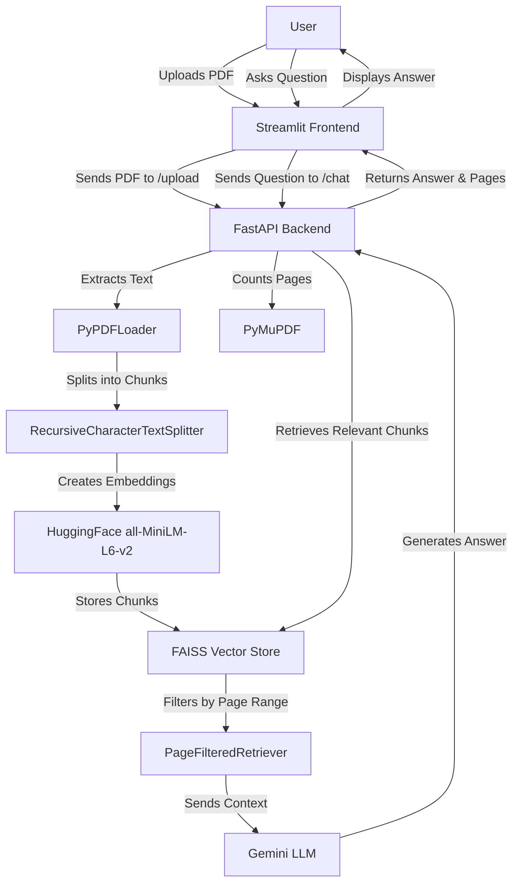

# Knowra: Your Aura of Answers


**Knowra** is an intelligent PDF chatbot that allows users to upload text-based PDF documents and ask questions about their content. Powered by a Retrieval-Augmented Generation (RAG) pipeline, Knowra extracts text from PDFs, stores it in a FAISS vector database, and uses Google’s Gemini LLM to provide accurate, context-aware answers with page references. The application features a sleek Streamlit frontend and a robust FastAPI backend, making it easy to explore and interact with your documents.

## Table of Contents
- [Overview](#overview)
- [Features](#features)
- [Tech Stack](#tech-stack)
- [Demo](#demo)
- [Prerequisites](#prerequisites)
- [Setup Instructions](#setup-instructions)
  - [Clone the Repository](#clone-the-repository)
  - [Install Dependencies](#install-dependencies)
  - [Configure Environment Variables](#configure-environment-variables)
  - [Download Embedding Model](#download-embedding-model)
- [Running the Application Locally](#running-the-application-locally)
  - [Start the Backend](#start-the-backend)
  - [Start the Frontend](#start-the-frontend)
- [Usage](#usage)
- [Workflow](#workflow)
- [Limitations](#limitations)
- [License](#license)

## Overview
Knowra enables users to unlock insights from their PDFs through an intuitive chat interface. Upload a PDF, select specific pages or the entire document, and ask questions to get precise answers sourced from the document’s content. The application is ideal for students, researchers, or anyone needing to quickly extract information from text-based PDFs.

## Features
- 📄 **PDF Upload**: Upload text-based PDFs via a user-friendly Streamlit interface.
- 🔍 **Page Selection**: Analyze the entire document or a specific page range.
- 💬 **Interactive Chat**: Ask questions about the PDF and receive answers with page references.
- 🤖 **RAG Pipeline**: Uses FAISS for vector search and Gemini for natural language answers.
- 🎨 **Responsive Design**: Dark-themed UI with mobile-friendly styling.
- ⚡ **FastAPI Backend**: Efficiently handles PDF processing and question-answering.

## Tech Stack
- **Frontend**: Streamlit (Python) for the web interface.
- **Backend**: FastAPI (Python) for API endpoints.
- **PDF Processing**:
  - `PyPDFLoader` (LangChain) for text extraction.
  - `PyMuPDF` (`fitz`) for page counting.
- **Vector Database**: FAISS for storing document embeddings.
- **Embeddings**: HuggingFace’s `all-MiniLM-L6-v2` model.
- **LLM**: Google Gemini (`gemini-1.5-flash`) for answer generation.
- **Text Splitting**: LangChain’s `RecursiveCharacterTextSplitter`.
- **Environment Management**: `python-dotenv` for `.env` variables.
- **Python Version**: 3.10.9.

## Demo  
📹 **Watch the demo video**: [Watch on YouTube](https://youtu.be/NO5e-s5kp84)

## Prerequisites
- **Python**: Version 3.10.9.
- **Google Gemini API Key**: Obtain from Google Cloud Console.
- **Git**: For cloning the repository.

## Setup Instructions

### Clone the Repository
```bash
git clone https://github.com/your-username/knowra.git
cd knowra
```

*Note*: Replace `your-username` with your GitHub username or the repository URL.

### Install Dependencies
1. Create a virtual environment:
   ```bash
   python -m venv venv
   source venv/bin/activate  # On Windows: venv\Scripts\activate
   ```
2. Install required packages:
   ```bash
   pip install -r requirements.txt
   ```
   *Note*: Ensure `requirements.txt` includes:
   ```
   streamlit==1.39.0
   fastapi==0.115.0
   uvicorn==0.32.0
   python-dotenv==1.0.1
   langchain==0.3.4
   langchain-community==0.3.3
   langchain-google-genai==2.0.1
   pymupdf==1.24.11
   faiss-cpu==1.9.0
   huggingface_hub==0.26.0
   requests==2.32.3
   cachetools==5.5.0
   python-multipart==0.0.12
   ```
   If `requirements.txt` is missing, create it with the above content or install packages manually.

### Configure Environment Variables
1. Create a `.env` file in the project root:
   ```bash
   touch .env
   ```
2. Add the following variables:
   ```
   GEMINI_API_KEY=your_gemini_api_key
   BACKEND_URL=http://localhost:8000
   ```
   - **GEMINI_API_KEY**: Your Google Gemini API key from Google Cloud Console.
   - **BACKEND_URL**: The backend API URL. Use `http://localhost:8000` for local runs or your Render URL (e.g., `https://your-backend.onrender.com`) for deployment.

### Download Embedding Model
1. Download the HuggingFace embedding model (`all-MiniLM-L6-v2`):
   ```bash
   python -c "from huggingface_hub import snapshot_download; snapshot_download(repo_id='sentence-transformers/all-MiniLM-L6-v2', local_dir='models/all-MiniLM-L6-v2')"
   ```
2. Ensure the model is stored in `models/all-MiniLM-L6-v2` relative to the project root.

## Running the Application Locally

### Start the Backend
1. In a terminal, activate the virtual environment:
   ```bash
   source venv/bin/activate  # On Windows: venv\Scripts\activate
   ```
2. Run the FastAPI server:
   ```bash
   uvicorn main:app --host 0.0.0.0 --port 8000
   ```
   - The backend will be available at `http://localhost:8000`.
   - Check the health endpoint: `http://localhost:8000/` (should return `{"status": "RAG chatbot is up and running!"}`).

### Start the Frontend
1. Open a new terminal, activate the virtual environment, and navigate to the project root.
2. Run the Streamlit app:
   ```bash
   streamlit run app.py
   ```
   - The frontend will open in your browser at `http://localhost:8501`.

### Access the Application
1. **Open `http://localhost:8501` in your browser**
2. **Upload a PDF**:
   - Use the sidebar to upload a text-based PDF.
3. **Select Pages**:
   - Choose “Full Document” or a specific “Page Range.”
4. **Start Chatting**:
   - Enter your name to begin.
   - Ask questions about the PDF content.
   - View answers with page references in the chat interface.
5. **Manage Chat**:
   - Clear the chat or return to document settings using the buttons provided.

## Workflow
The following diagram illustrates the data flow in Knowra, from PDF upload to answer generation:



**Explanation**:
1. The user uploads a PDF via the Streamlit frontend.
2. The frontend sends the PDF to the FastAPI backend’s `/upload` endpoint.
3. The backend uses `PyPDFLoader` to extract text and `PyMuPDF` to count pages.
4. Text is split into chunks using `RecursiveCharacterTextSplitter`.
5. Chunks are embedded using `all-MiniLM-L6-v2` and stored in a FAISS vector store.
6. The user asks a question, which the frontend sends to the `/chat` endpoint.
7. The backend retrieves relevant chunks from FAISS, filtered by the selected page range.
8. The Gemini LLM generates an answer based on the retrieved chunks.
9. The answer and source page numbers are returned to the frontend and displayed to the user.

## Limitations
- **PDF Support**: Only text-based PDFs are supported. Image-based or scanned PDFs are not compatible.

## License
This project is licensed under the MIT License. See the [LICENSE](LICENSE) file for details.

---

Built with ❤️ using Python, Streamlit, and FastAPI.